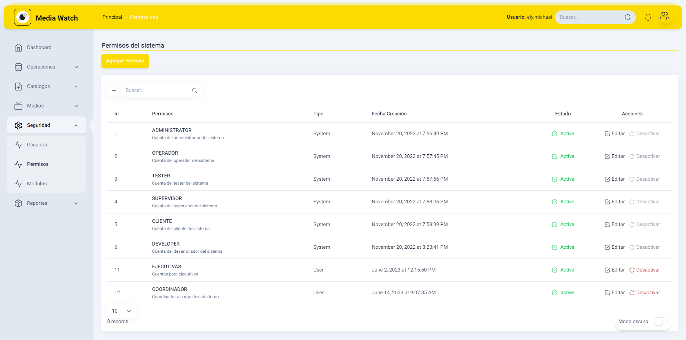
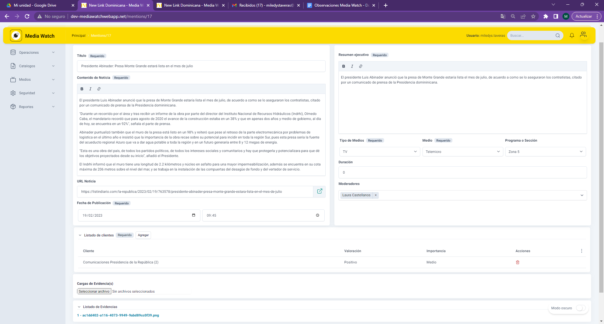
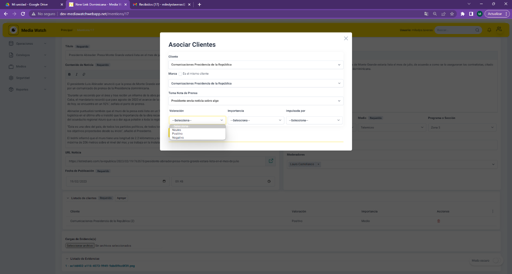

# Manual de Usuario Final


## Tabla de Contenido


[TOC]


# INTRODUCCION

Media Watch es una herramienta creada a la medida de las necesidades de la empresa NewLink para servir de monitor de las noticias consideradas de interés de sus clientes. Para acceder a ella es necesario contar con acceso a internet y recibir del administrador del sistema el enlace, el usuario y la clave de acceso para que sea posible utilizar este recurso.

# SISTEMA MEDIA WATCH

## Acceso a Plataforma MediaWatch

Para acceder a la plataforma, el administrador les crea sus usuarios con su dirección de correo electrónica y sus datos generales, al final, va a recibir un correo con las siguientes informaciones: usuario y contraseña temporal para acceder al sistema a través de un enlace de activación de cuenta. Solo debe ingresar con las credenciales que ha recibido en el correo electrónico para acceder a la aplicación.


```Ilustración 1. Ejemplo de correo recibido por parte de la plataforma MediaWatch.```

#### Paso a paso:

- En su bandeja de correo electrónico va a recibir un correo con las credenciales para acceder a la aplicación.

- Cuando acceda al sistema, por favor cambie su contraseña por una de su preferencia.

- Salga del sistema a través de la opción Log-out, e ingrese nuevamente.

## Portal de Acceso

Una vez utilizamos el enlace para acceder a la herramienta, debemos colocar nuestro usuario y clave. Pulsamos “Login” para que el sistema realice la validación de tus credenciales y preferencias para permitir el acceso al sistema de acuerdo con el perfil definido.


```Ilustración 2 - Portal de acceso Media Watch. ```

Si los datos de acceso son correctos, accederás al sistema de acuerdo con los permisos definidos para tu perfil. El sistema carga con un tablero que muestra las noticias más recientes, entre otros datos.


```Ilustración 3 - Página principal sistema Media Watch.```

## Personalizar Sistema por Usuario

En la sección inferior derecha del sistema, en cualesquiera de sus opciones de menú, se puede activar/desactivar el modo oscuro. Esta característica del sistema se activa/desactiva por usuario, por lo que opera de manera individual.

```Ilustración 4 - Portal de acceso Media Watch Modo Oscuro.```

## Recuperar Clave de Acceso

El sistema cuenta con la facilidad de recuperar tu contraseña si la has olvidado. Sólo debes pulsar la opción “¿Olvidaste tu contraseña?”


```Ilustración 5 - Portal de acceso Media Watch.```

Esta opción te dirigirá a un nuevo enlace que solicitará tu usuario o correo electrónico registrado y pulsas el botón “Enviar”. Si no deseamos ejecutar esta opción, sólo debes hacer clic sobre la opción “Regresar”.


```Ilustración 6 - Solicitar recuperación de contraseña.```

En la nueva Ventana, debe colocar el código de acceso que llegó a tu correo, tomar en cuenta que este código tiene un tiempo de validez definido por lo que debes culminar el proceso de cambio a tiempo. Colocar la nueva clave y confirmarla. Pulsa la opción “Enviar” una vez completes todos los datos.


```Ilustración 7 - Recuperar contraseña con código de acceso.```

# DATOS DE CUENTA

Desde cualquier lugar en el sistema, puedes acceder a los datos de tu cuenta, haciendo clic en el botón superior derecho, justo al lado de las notificaciones. En este menú encontrarás las siguientes opciones:

- Nombre de tu usuario.

- Fecha y hora.

- Ver/editar tu perfil.

- Agregar Cliente.

- Emular Cliente.

- Cambiar contraseña.

- Ayuda.

- Salir del sistema.


```Ilustración 8 – Datos de tu cuenta.```

## Mi Perfil

Si accedes a tu perfil, podrás visualizar tu nombre, cuenta de correo electrónico, emular clientes (si cuentas con autorización), el tipo de cuenta que posees y el listado de clientes que tienes configurado para poder emular.

Ilustración 9 - Mi perfil de usuario.

## Emular Clientes

Para verificar los accesos que tendrá un cliente y/o revisar cualquier situación que este reporte a cerca de su usuario, si eres el operador que le asiste, puedes ejecutar una revisión a partir de este proceso. Al seleccionar la opción de “Emular Cliente” del menú disponible en tus datos de usuario, el sistema te dirigirá a nueva ventana donde seleccionarás el cliente a emular. Tomar en cuenta que sólo puedes realizar esta operación a los clientes configurados en tu perfil para estos fines.

Ilustración 10 - Selección de cliente para emular.

Elegimos el cliente a emular y pulsamos el botón “Seleccionar”.

Ilustración 11 - Selección de cliente para emular

Visualizamos el sistema tal como lo observa el cliente y tendremos acceso a las mismas opciones habilitadas para él.

Ilustración 12 - Visualización del sistema para el cliente emulado.

Ilustración 13 - Visualización del sistema para el cliente emulado.

Para regresar a nuestro perfil de usuario y accesos, sólo debemos hacer clic en la X de cierre de emulación.

## Búsqueda General de Noticias

Una vez nos encontramos en la página principal del sistema o en cualquier otra sección, tendrás disponible en la barra superior derecha, un buscado de noticias. Allí escribes las palabras que entiendas se relacionan con la noticia que deseas buscar y te presentará las coincidencias.

Ilustración 14 - Búsqueda general de noticias.

Al hacer clic sobre la noticia deseada, te mostrará la noticia detallada donde tienes opción de visualizarla haciendo clic sobre la imagen o imprimirla pulsando el botón “Print” en el margen superior derecho.

Ilustración 15 - Visualización de noticias.

Ilustración 16 - Visualización de noticias ampliada.

# DASHBOARD

El Dashboard está visible como portada cuando accedemos al sistema y es la primera opción de menú disponible. Este nos permite tener una vista de rápida de los indicadores o métricas de interés y cuenta con la información actualizada al momento de ingresar o de acceder a esta opción. La misma puede ser actualizar al hacer clic sobre la opción en el margen superior derecho.

Ilustración 17 - Dashboard

En el margen superior derecho, el Dashboard presenta los últimos clientes registrados, donde al pulsar el botón “Ver más” nos dirige a la opción de registro de clientes cuya portada es el reporte de clientes.

Ilustración 18 - Registro y reporte de Clientes

En su margen inferior derecho, se muestran las últimas noticias. El sistema de manera dinámica va mostrando dichas noticias, pero de igual manera nos permite navegar por nuestra cuenta al pulsar los botones correspondientes:  Si pulsamos el botón “Ver Noticia”, el sistema nos presenta la noticia con todos sus detalles en modo de visualización / no editable.

Ilustración 19 - Visualización de noticias

# OPERACIONES

## Registro de Noticias

Para registrar una noticia, nos dirigimos al menú “Operaciones” y hacemos clic en la opción “Registro Noticias”. Nos aparecerá una pantalla donde pasaremos a colocar el contenido de la noticia. Los campos mínimos requeridos/obligatorios para el registro, están resaltados en fondo gris.

Ilustración 20 - Registro de Noticias

Es importante conocer que, para poder seleccionar ciertos datos durante el registro de una noticia, estos deben ser definidos previamente en el sistema. Esto aplica para varios casos, tales como:

- Tipo de Medios

- Medio

- Programa o Sección

- Tamaño

- Altura

- Longitud

- Moderadores

- Listado de Clientes.

Ilustración 21 - Registro de Noticias Completado

En el registro noticias, podemos cargar archivos relacionados a la misma y, en el resumen ejecutivo, podemos incluir enlaces a informaciones relacionadas adicionales. El enlace a la noticia original, lo colocamos en el campo “URL Noticia”.

Ilustración 22 - Registro de Noticias Completado

Ilustración 23. Registro de noticias duplicadas.

El sistema tiene una validación de registros duplicados que te permite evitar que una misma noticia se guarde varias veces en el sistema para el mismo medio, fecha de publicación y página en caso de que exista.

Los campos utilizados para validar que los registros no se encuentren duplicados son los siguientes:

- Tipo de medio.

- Medio.

- Título de noticia.

- Fecha de Publicación.

- Página (en caso de utilizarse)

Para asociar clientes a la noticia, pulsamos la opción “Agregar” en el listado de clientes. Esta opción, nos dirigirá a una nueva venta donde podremos seleccionar, de un listado previamente registrado, el cliente que deseamos asociar. Por defecto, se establece como “Marca” al mismo cliente, pero si se enlazará a otra de las marcas relacionadas al cliente, sólo desmarcamos el cotejo y nos permitirá seleccionar de la lista, previamente registrada, la marca apropiada para la noticia que estamos registrando.

Importante señalar que las noticias que tengan más de 48 horas de ocurridas, no se enviaran en las notificaciones diarias que se les envían a los clientes.

Ilustración 24 - Asociar Clientes en Registro de Noticias

Luego, debemos completar los datos, previamente registrados en el sistema, seleccionando las siguientes opciones para posteriormente hacer la asociación y guardar la noticia:

- Tema de la Nota de Prensa

- Valoración

- Importancia

- Impulsada por…

## Validaciones en formulario de Noticias

Existe un grupo de campos que son requeridos por el formulario y que son validados antes de guardar la noticia que deben ser completados antes de guardar. En el formulario principal, los campos requeridos:

- Título.

- Contenido.

- Análisis.

- Url Noticias.

- Tipo de medio.

- Medio.

- Evidencia.

- Clientes Asociados.

- Si se selecciona el tipo de medio Prensa Escrita:

- Longitud: Si el tipo de medio seleccionado es "prensa escrita".

- Altura: Si el tipo de medio seleccionado es "prensa escrita".

- Página: Si el tipo de medio seleccionado es "prensa escrita".

- Programa o Sección: Si el tipo de medio seleccionado es "prensa escrita".

- Tamaño: Si el tipo de medio seleccionado es "prensa escrita".

Ilustración 25. Pantalla de registro de noticias mostrando los errores de los campos requeridos.

Ilustración 26. Campos adicionales de campos requeridos que se activan al seleccionar el tipo de medio "prensa".

Ilustración 27. Campos requeridos del detalle de la noticia asociada a los clientes.

## Asociar un Grupo de Interés a la noticia

El segundo paso es registrar el grupo de interés asociado al cliente al seleccionar dicho cliente relacionado con la noticia o nota de prensa a registrar.

Ilustración 3.  Asocia el grupo de interes a la noticia.

## Filtrar noticias por Grupo de Interés

Por último, cada noticia se mostrará asociada al grupo de interés que seleccione y podrá filtrar la misma en el listado de noticias utilizando su filtro de Grupo de interés asociado a la noticia.

Ilustración 28. Se agregó un nuevo campo de grupo de interés que permitirá filtrar los registros por ese campo que se encuentra previamente asociado al cliente.

## Listado de Noticias

Para visualizar las noticias registradas en el sistema, nos dirigimos al menú de operaciones y pulsamos la opción “Listado de Noticias” o desde el registro de noticias, pulsamos la opción “ver listado”.

Ilustración 29 - Listado de Noticias

Seleccionamos el rango de fecha deseado para la búsqueda de noticias y presionamos la lupa para obtener los resultados. También puede realizarse la búsqueda seleccionando cualquier control de los distintos filtros que se encuentran en el sistema. El sistema permite filtrar las noticias por: fecha, noticias, tipo de medio, cliente, marcas, notas de prensa, medio, valoración, importancia, impulsado por, operadores y contenido.

Ilustración 30 - Búsqueda del Listado de Noticias

Considerar que los filtros de Notas de prensa se encuentra relacionados a los clientes y sus marcas. En otras palabras, debe seleccionar primero el cliente, luego la marca y al final la nota de prensa que deseamos filtrar.

Ilustración 31 - Resultado de la Búsqueda de Noticias Registradas

Si, adicional al rango de fechas conocemos alguna palabra relacionada al título de la noticia que deseamos localizar, en el campo “Buscar” incluimos este criterio y el sistema nos mostrará las noticias que coincidan los filtros indicados. Los filtros están extendidos para filtrar las informaciones a partir de cualquier campo de los capturados en el sistema.

Ilustración 32 - Búsqueda Filtrado de Noticias Registradas

Una vez hemos encontramos la noticia requerida, tenemos dos acciones específicas que podemos ejecutar desde esta ventana:

- Hacer clic en el URL de la noticia, lo cual nos abre un modo nuevo en el explorador que nos dirige hacia la noticia original.

- Editar la noticia en caso de que necesitemos corregir o incorporar informaciones. Para ello hacemos clic sobre la opción “Editar” y nos presentará la noticia completa tal como fue registrada para que podamos hacer los ajustes que sean necesarios.

> **Nota:** en las pantallas donde se muestran listados, tenemos la opción de seleccionar cuantos registros deseamos ver en la misma ventana.

Ilustración 33 - Listado de Noticias Registradas - Navegación

Si desea exportar un grupo de registros a Excel, recomendamos que seleccione la mayor cantidad de páginas posible ya que solo se exportan los registros que se muestra en pantalla para una mayor eficiencia del sistema.

## Registros Post Sociales

Este proceso permite registrar las redes sociales que Newlink desea monitorear, desde el registro de medio, las cuentas y las noticias a seguir.

### Registro de redes sociales

```bash

Paso 1. Primero procedemos a registrar las redes sociales a monitorear accediendo a través de la opción Media  Redes Sociales. El módulo aparece inicializado con 4 de las principales redes sociales, en caso de necesitar registrar nuevas redes, proceder haciendo clic sobre “Agregar nueva red”

```

Figure 1. Visualización de redes sociales a monitorear.

En la siguiente pantalla solo tiene que ingresar el nombre y la URL de la red social a ingresas y presione el botón Guardar.

Figure 2. Registro de nueva red social.

### Registros de Cuentas y Noticias de Redes Sociales

Luego de registrar las redes sociales a monitorear, el siguiente paso sería registrar los suscriptores que deseamos dar seguimiento por red social.

```bash

Paso 2. Vamos a la opción Operaciones  Registro Post Sociales para registrar los subscriptores y comenzar a registrar las noticias de redes sociales.

```

Ilustración 3. Visualización de suscriptores.

Para agregar una nueva cuenta o suscriptor a monitorear, presione el botón “Agregar nuevo suscriptor” y llevar el pequeño formulario donde el usuario debe seleccionar la red social, agregar la cuenta a monitorear y el nombre de la misma.

Ilustración 4. Registro de suscriptor.

Luego de tener nuestra cuenta a monitorear, solo debemos registrar las noticias a través del botón “Post” donde se va a mostrar una pantalla emergente con los datos a monitorear.

Ilustración 5. Registro de Noticias.

Las opciones de edición y eliminación de cuentas tienen el mismo flujo que en los otros procesos del sistema.

### Reporte de Redes Sociales

Los registros capturados en el módulo de operaciones pueden ser consultado en el nuevo reporte creado para consultar las informaciones capturadas previamente.

Figure 3. Módulo de reportes administrativos.

Figure 4. Reporte de redes sociales.

Figure 5. Visualización de filtros adicionales en el reporte.

# CATALOGOS

## Clientes

Para gestionar los clientes en la plataforma, nos dirigimos al menú “Catálogos” y hacemos clic en la opción “Clientes”. Nos aparecerá una pantalla con el listado de los clientes registrados con algunas de sus informaciones básicas, tal como su correo, estado, si es recurrente, entre otros. Desde este listado, podemos ejecutar dos acciones: editar o activar/desactivar el cliente pulsando la opción correspondiente para cada caso.

Ilustración 34 - Listado de Clientes Registrados - Sin Filtro

Como se ha observado en otras consultas, tenemos la opción de hacer búsquedas más específicas escribiendo el nombre del cliente, parcial o total, que deseamos localizar y hacer clic en la lupa. Si el campo permanece en blanco, nos presentará en bloques todos los clientes registrados como se aprecia en la figura anterior.

Ilustración 35 - Listado de Clientes Registrados - Con Filtro

Para registrar un nuevo Cliente, sólo debemos pulsar el botón “Agregar Cliente” del menú Catálogos opción “Clientes”.

Ilustración 36 - Agregar Cliente

Nos aparecerá una ventana donde colocaremos el nombre de la empresa a registrar y su correo. Por defecto está habilitado como Cliente Recurrente, pero sólo debemos desplazar la barra a la izquierda si no aplica. Pulsamos el botón “Registrar” y el sistema nos informa que el cliente fue creado.

Ilustración 37 - Registrar Nuevo Cliente

Adicional al mensaje arrojado, se activa la campana de notificaciones y allí podemos apreciar que se ha registrado un nuevo cliente. Las notificaciones que aparecen en la campana se pueden visualizar desde cualquier lugar en que nos encontremos dentro del sistema.

Ilustración 38 - Notificación de Cliente Agregado

Ilustración 39 - Notificación de Noticia Agregada

Para agregar datos adicionales al cliente registrado, buscamos su registro en el listado, pulsamos la opción “Editar” y el sistema nos presentará una pantalla con los datos previamente capturados del cliente.

Ilustración 40 - Contenido del Cliente Registrado

En esta pantalla podemos actualizar los datos existentes del cliente, activarle la recepción de boletines vía electrónica y agregar Actores, Marcas y Palabras Clave.

Ilustración 41 - Contenido del Cliente Registrado

Tanto para el registro de los Actores como de las Palabras Clave, sólo debemos hacer clic sobre la opción agregar en cada caso.

Ilustración 42 - Registro de Actores en el Cliente

Ilustración 43 - Registro de Palabras Clave en el Cliente

Para el registro de las Marcas del cliente, hacemos clic en agregar y nos aparecerá una ventana donde colocaremos el nombre de la Marca y seleccionaremos las categorías a la cual esta pertenece.

Ilustración 44 - Registro de Marcas en el Cliente

## Mover marcas de un cliente a otro

Para mover una marca de un cliente a otro, solo tenemos que ir al cliente desde donde deseamos mover la marca (debemos considerar que la marca asignada a cada cliente por defecto no permite moverla) y seleccionamos un menú contextual que se encuentra a la izquierda de cada marca, delimitada por tres puntos verticales. Ver siguiente imagen con el ejemplo.

Ilustración 45. Presiona los tres puntitos antes de la marca y selecciona el menú mover marca.

Ilustración 46. Presione sobre el botón contextual mover marca.

Luego de seleccionar la opción de mover cliente, le saldrá una ventana emergente donde podrá seleccionar el cliente hasta donde desea mover la cuenta.

Ilustración 47. En el modal siguiente, selecciona el cliente a donde desea mover la marca en cuestión.

## Registrar los Grupos de Interés en el perfil del cliente

El primer paso consiste en agregar a los clientes los grupos de interés con los que se desea segmentar las noticias de un cliente. Seleccione el cliente, edite la información, y agregue los diferentes grupos de interés asociados a ese cliente separados por coma “,”.

Ilustración 48. En el campo de grupo de interés puede seleccionar uno o más valores separados por coma.

Después de agregar su listado de grupos de interés, estos estarán disponibles visualmente en el listado de clientes, justo debajo del nombre de la cuenta del cliente.

Ilustración 49. En el catálogo de clientes se podrá visualizar el grupo de interés asociado al cliente. Un cliente puede estar asociado a uno o más grupos de interés.

## Sectores

Para gestionar los Sectores, Subsectores y Categorías Económicas que maneja el sistema, nos dirigimos al menú “Catálogos” y hacemos clic en la opción “Sectores”. Nos aparecerá una pantalla con el árbol que contiene el Listado de las Categorías Económicas.

Ilustración 50 - Listado de Categorías Económicas

Desde este árbol, podemos ejecutar las siguientes acciones:

- Agregar Nueva Categoría (Sector). Pulsamos la opción correspondiente, digitamos el nombre del sector, subsector o categoría y hacemos clic en el botón “Registrar”.

Ilustración 51 - Registro de Nuevo Sector, Subsector o Categoría

Ilustración 52 - Registro de Nuevo Sector, Subsector o Categoría

Ilustración 53 - Confirmación Creación de Sector, Subsector o Categoría

- Modificar la organización del árbol. Hacer clic sobre el valor que deseemos mover para arrastrarlo y soltarlo donde queremos ubicarlo, sea este dentro o fuera de un Sector o Subsector.

Ilustración 54 - Sector, Subsector o Categoría Creada

Ilustración 55 - Sector Pública y Privada Agrupados como Subsector dentro del Sector Salud

Ilustración 56 - Sector Salud pasa a ser un nodo superior al Sector Zona Franca

- Si necesitamos editar un nodo del árbol, sólo hacemos doble clic sobre él y modificamos el dato que este contiene.

Ilustración 57 - Modificar Nodos Existentes en el árbol

- Al concluir con los ajustes, hacer clic sobre el botón “Confirmar Cambios” para que estos se almacenen.

- Nota: el sistema presenta la fecha y hora en que fue actualizado el árbol por última vez. La información se puede ver al pie del Listado.

## Temas Notas de Prensa

Para gestionar los Temas Notas de Prensa, nos dirigimos al menú “Catálogos” y hacemos clic en la opción “Temas Notas de Prensa”. Nos aparecerá una pantalla con el listado de los temas notas de prensa registrados con algunas de sus informaciones básicas, tal como el tema, cliente, marca, entre otros. Desde este listado, podemos ejecutar dos acciones: editar o activar/ desactivar el pulsando la opción correspondiente para cada caso.

Ilustración 58 - Temas Notas de Prensa – Sin Filtro

Como se ha observado en otras consultas, tenemos la opción de hacer búsquedas más específicas escribiendo el nombre del tema, parcial o total, que deseamos localizar y hacer clic en la lupa. Si el campo permanece en blanco, nos presentará en bloques todos los temas registrados como se aprecia en la figura anterior. En esta pantalla, el usuario también puede filtrar por clientes y marcas, seleccione el cliente y si desea verlo por marcas, la marca de la nota de prensa.

Ilustración 59 - Temas Notas de Prensa – Con Filtro

Para registrar un nuevo Tema Nota de Prensa, sólo debemos pulsar el botón “Agregar Tema” del menú Catálogos opción “Temas Notas de Prensa”. El sistema solicitará que ingresemos el Tema Nota de Prensa a registrar, selecciones el Cliente, Marca y colocarlo activo/inactivo.

Ilustración 60 - Registrar Temas Notas de Prensa

En la colocación de la Marca, el sistema por defecto activa el cotejo “Es el mismo cliente”, pero podemos cambiarlo al retirar el cotejo ya que se activa el listado donde podemos seleccionar una de las marcas previamente registradas del cliente.

Ilustración 61 - Registrar Temas Notas de Prensa

Ilustración 62 - Registrar Temas Notas de Prensa

Ilustración 63 - Registrar Temas Notas de Prensa

Ilustración 64 - Desactivar Temas Notas de Prensa

## Tasa de Cambio

Para gestionar la Tasa de Cambio, nos dirigimos al menú “Catálogos” y hacemos clic en la opción “Tasa de Cambio”. Nos aparecerá una pantalla con el listado de los últimos cambios de tasa registrados con su valor, fecha, moneda y tasa. Se puede apreciar un calendario donde podemos navegar por los diferentes días para verificar la tasa registrada en ese día.

Ilustración 65 - Tasa de Cambio

La tasa de cambio se actualiza diariamente desde un servicio expuesto por el Banco de Reservas. Se verifica y actualiza de manera automática tres veces al día en los horarios 08:30 am, 12:30 y 5:30 PM. De requerir registrar la tasa manualmente, hacemos clic en “Agregar tasa del día” o modificamos la tasa previamente registrada haciendo en el lápiz que se encuentra a la derecha de la tasa a modificar.

Ilustración 66 - Registrar Tasa de Cambio

Ilustración 67 - Registrar Tasa de Cambio

Ilustración 68 - Mensaje de Tasa de Cambio Almacenada

Ilustración 69 - Registro / Actualización de Tasa de Cambio

# MEDIOS

## Medios

Para gestionar los medios en la plataforma, nos dirigimos al menú “Medios” y hacemos clic en la opción que lleva el mismo nombre. Nos aparecerá una pantalla con el listado de los medios registrados con algunas de sus informaciones básicas, tal como su nombre, tipo de medio, estado, entre otros. Desde este listado, podemos ejecutar dos acciones: editar o activar/desactivar el medio pulsando la opción correspondiente para cada caso.

Ilustración 70 - Registro y Consulta de Medios

Para registrar un nuevo Medio o Canal, sólo debemos pulsar el botón “Agregar Medio”. En la nueva pantalla nos solicitará colocar el nombre del nuevo Medio o Canal, la Frecuencia o Localidad, Tipo de Medio y una Descripción.

Ilustración 71 - Registro Nuevo Medio o Canal

En la pantalla inicial, tenemos la opción de hacer búsquedas más específicas escribiendo el nombre del Medio o Canal, parcial o total, que deseamos localizar y hacer clic en la lupa. Si el campo permanece en blanco, nos presentará en bloques todos los Medios o Canales registrados.

Ilustración 72 - Consulta de Medios o Canales

Si deseamos modificar el Medio o Canal, hacemos clic en el botón “Editar” del registro deseado y el sistema nos presentará el detalle de las informaciones que lo conforman.

Ilustración 73 - Detalle de Medios o Canales Individuales

Cada Medio o Canal tiene definidos los Programas que en él se realizan y al pasar al proceso de modificación de estos, tenemos la oportunidad de registrar, modificar o activar/desactivarlos. Para registrar un nuevo Programa, hacemos clic sobre la opción “Agregar” en el área correspondiente a estos datos y completamos los datos requeridos: nombre del programa, moderadores, marcar los días en que se realiza, hora de inicio y fin, activarlo o dejarlo inactivo.

Ilustración 74 - Registro de Programa o Sección de un Medio o Canal

Para modificar un Programa, nos dirigimos al área correspondiente dentro del Medio o Canal al cual pertenece y hacemos clic sobre el botón editar que es una de las tres acciones permitidas.

Ilustración 75 - Modificación de Programa o Sección de un Medio o Canal

A los programas registrados, podemos configurarle o actualizarle la tasa que este tenga asignada. Para ello hacemos clic en el botón correspondiente que es una de las tres acciones permitidas que incluyen edita el Programa o activarlo/desactivarlo. Colocaremos el rango de fechas para el cual aplica la tarifa y su valor por la duración del contenido definido en la noticia, además de registrarlo como activo/inactivo.

Ilustración 76 - Registrar Tarifa para Medios Audiovisuales

Si deseamos cambiar la tarifa sin afectar el histórico, desactivamos la tarifa actual y registramos la nueva con su tiempo de vigencia definido.

Ilustración 77 - Modificación de Tarifa por Programa

Cuando el Canal o Medio pertenece a la categoría de Prensa Escrita o Digital, en lugar de Programas tendremos Secciones y en estas las tarifas requieren informaciones adicionales tal como la Columna x Pulgada para la cual aplica la tarifa registrada o a registrar, entre otros datos.

Ilustración 78 - Modificación de Tarifa por Sección

Para los medios impresos, las tarifas se pueden agregar de forma agrupada, es decir, desde la pantalla de medios se puede agregar una tarifa múltiple que aplicará para todas las secciones que no tengan su tarifa creada. Al lado de agregar programa, tendremos un nuevo botón denominado “agregar tarifa”.

Ilustración 79. Nuevo botón de agregar tarifa permitirá agregar la tarifa a un solo medio.

Ilustración 80. Capturar tarifas múltiples.

Adicional, tenemos un nuevo tipo de medio, revistas, que tiene su propio tarifario donde solo se manejan los siguientes tipos: ½ página, ¼ de página y 1 página.

Ilustración 81 - Registrar Tarifas

# SEGURIDAD

## Seguridad

Estos módulos fueron diseñados para fines administrativos de la aplicación para mostrar cómo se encuentra distribuida la distribución de los módulos y permisos de la aplicación y poder dar mantenimientos a los usuarios del sistema.

## Usuarios

En este módulo los usuarios administradores pueden crear y modificar los usuarios del sistema, así como incluir las distintas funcionalidades requeridas para que los usuarios puedan realizar las funciones que se esperan de ese usuario.

Ilustración 82. Listado de Usuarios.

Ilustración 83. Registro de nuevos usuarios.

### Edición de Usuarios

En esta pantalla, los administradores pueden desactivar/activar usuarios, pueden indicar si el usuario es interno (para uso exclusivo de NewLink), asignar los permisos, indicar si el usuario tiene permiso para emular clientes y poder visualizar el perfil de los clientes de un cliente X.

Ilustración 84. Edición de usuarios.

## Permisos

En esta pantalla se definen los permisos administrativos que posteriormente se le van a asignar a cada tipo de usuario.

Ilustración 85. Asignación de permisos de usuarios.

## Módulos

Listado de todos los módulos que conforman el sistema, los mismos no pueden ser modificados o editados, se encuentran solo de modo lectura.

Ilustración 86. Listado de módulos del sistema.

# REPORTES

## Reportes

Este es el módulo de reportes predefinidos que viene con la aplicación. Estos a su vez se dividen en reportes administrativos (para uso de los usuarios de Newlink) y reportes de Clientes (que solo deben ser visualizados desde el perfil de cada uno de los usuarios de los clientes del aplicativo).

## Reportes Administrativos

Los reportes administrativos se encuentran divididos a su vez en reportes administrativos, para dar seguimiento a la parte operativa y administrativa del sistema, así como reportes de supervisores, donde se podrán visualizar los reportes de las noticias registradas en el sistema.

Ilustración 87. Módulo de reportes administrativos

### Reportes Administrativos

En este bloque de reportes administrativos, los usuarios tendrán acceso a los siguientes módulos:

- Reporte de Errores del Sistema.

- Reporte de Log de Usuarios.

- Reporte de Sesión Activa.

- Reporte de Contenido por Usuarios.

#### Reporte de Errores del Sistema

Ilustración 88. Muestra los distintos errores registrados en el sistema.

#### Reporte de Log de Usuarios

Ilustración 89. Permite al equipo de desarrollo visualizar todas las operaciones realizadas por un usuario.

#### Reporte de Sesión Activa

Ilustración 90 - Log Sesiones Activas por Usuarios

#### Reporte de Contenido por Usuarios

Este reporte permite visualizar la cantidad de contenidos únicos registrados por usuarios en el sistema.

Ilustración 91. Reporte permite visualizar la cantidad de contenidos registrados por usuarios.

Ilustración 92. Visualización de filtros adicionales.

### Reportes de Supervisores

En este módulo se pueden visualizar los siguientes reportes:

- Reportes General de Contenidos.

- Reportes de Noticias.

- Reportes de Notas de Prensa.

- Reportes por Clientes.

- Reportes por Categorías.

#### Reporte General de Contenidos

Ilustración 93. Permite visualizar todas las noticias registradas divididos por clientes

En este reporte se pueden visualizar todas las noticias y limitar los resultados por rango de fechas y contenido. En caso de desear una mayor delimitación de datos, puede hacer clic sobre filtros adicionales y limitar de forma más exhaustiva los registros a visualizar en el reporte. Estos mismos filtros se pueden visualizar en todos los reportes del sistema.

Ilustración 94. visualización de filtros adicionales.

Para exportar los datos en los distintos reportes, hacemos clic en el símbolo + que se encuentra a la izquierda de los campos de selección de fecha. Este nos desplegará un menú contextual donde seleccionaremos la opción Excel o CSV según su necesidad.

Ilustración 95 Descarga de datos de reportes a Excel y CSV

Al hacer clic sobre la opción correspondiente y de acuerdo con la configuración de su explorador, el archivo puede estar colocándose directamente a su carpeta de descarga por defecto o le solicitará que indique la ruta en la cual desea que se deposite el mismo.

Ilustración 96 Descarga directa a carpeta por defecto en Microsoft Edge

#### Reportes de Noticias

Ilustración 97. Visualización de reportes de noticias sin notas de prensa.

Ilustración 98. Ver detalle de una noticia registrada.

#### Reportes de Notas de Prensa

Ilustración 99. Ver noticias que solo tengan asociadas notas de prensa.

Ilustración 100. Ver detalle de la nota de prensa.

#### Reportes por Clientes

Ilustración 101. Ver noticias distribuida por clientes y sus marcas.

#### Reportes por Categorías

Este reporte permite visualizar como se han distribuido las noticias por categorías y fechas, siempre y cuando los clientes y marcas estén correctamente asociados a las distintas categorías del sistema.

Ilustración 102. Reporte por categorías y fecha.











